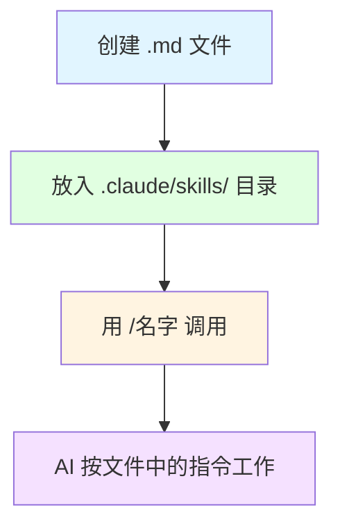

# 实战专题：Claude Code Skills — 打造你的 AI 专属工作流

> **课程时长**: 3 小时 | **难度**: 进阶 | **风格**: 实操为主

---

## 📋 本课概览

```
┌─────────────────────────────────────────────────────────────────┐
│  🎯 核心观点：Skill 让你把重复的 AI 指令变成一键命令            │
├─────────────────────────────────────────────────────────────────┤
│  📚 你将学到：                                                   │
│    • 理解 Skill 的本质（预写好的 AI 工作指令）                   │
│    • 体验和使用现成的 Skill                                      │
│    • 读懂 Skill 文件的结构                                       │
│    • 修改现有 Skill 来适配自己的需求                             │
│    • 从零编写一个完整的自定义 Skill                              │
│    • 测试、调试和分享你的 Skill                                  │
├─────────────────────────────────────────────────────────────────┤
│  🎁 你将带走：                                                   │
│    • 一张《Skill 结构速查卡》（打印贴工位）                      │
│    • 3 个填空式 Skill 模板（复制即用）                           │
│    • 一份《常见问题排查清单》                                    │
│    • 一个你亲手写的、可以立刻投入使用的自定义 Skill              │
│    • 10 个 Skill 创意清单（课后练习灵感）                        │
└─────────────────────────────────────────────────────────────────┘
```

**本课的承诺**：
- 不需要任何编程基础
- 你写的不是"代码"，而是"结构化的工作说明书"
- 每个步骤都有模板，照着填就行
- 学完当天就能用上

**学习路径**：


---

## 📖 课程内容

### Section 1：Skill 是什么（15 分钟）

#### 一个真实的烦恼

小王是一家互联网公司的运营，每周五都要写周报。她发现用 AI 写周报很方便，但每次都要输入一大段提示词：

> "你是一个周报助手。请把以下工作内容整理成周报格式，分为'本周完成'、'下周计划'、'需要协助'三个部分，每部分用要点列表，总字数不超过 300 字，语言简洁专业..."

每周都要找到这段话、复制、粘贴、再把本周内容贴进去。有时候忘了某个要求，输出格式就不对。

**如果有一种方法，让她只需要输入 `/weekly-report`，AI 就自动按她定义好的格式和要求来工作呢？**

这就是 Skill。

#### 核心类比：菜谱与厨师

把 Claude Code 想象成一位全能厨师：

- **没有菜谱时**：你每次都要口头描述"我要一道糖醋排骨，要用里脊肉，先炸后炒，糖醋比例 3:2..."——说漏一个细节，味道就不对
- **有了菜谱后**：你只需要说"做这道菜"，厨师按菜谱执行，每次味道都一样

**Skill 就是你写给 AI 的"菜谱"**。

#### 什么是 Claude Code？

一句话：**Claude Code 是运行在终端里的 AI 助手**，它能读写文件、执行命令、帮你完成各种任务。你通过打字和它对话，它帮你干活。

#### 什么是 Skill？

一句话：**Skill 是一个 `.md` 文件，里面写好了指令，让 Claude Code 按你定义的方式完成特定任务。**

它解决三个痛点：
1. 📋 **重复输入** — 不用每次都写一大段提示词
2. 🎯 **质量不稳定** — 指令固定，输出一致
3. 🧠 **记不住步骤** — 复杂工作流写进文件，永远不会忘

#### Skill vs 普通提示词

| 维度 | 普通提示词 | Skill |
|------|-----------|-------|
| 存储 | 每次手动输入或从笔记复制 | 保存为文件，永久可用 |
| 调用 | 粘贴一大段文字 | 输入 `/名字` 一个命令 |
| 稳定性 | 每次措辞不同，结果波动 | 指令固定，输出一致 |
| 分享 | 发消息给同事 | 放进项目目录，团队自动共享 |
| 复杂度 | 适合单步任务 | 可编排多步骤工作流 |

#### 小结

> 💡 **一句话记住**：Skill = 保存在文件里的 AI 工作指令，用 `/名字` 一键调用。

---

### Section 2：体验现成 Skill（20 分钟）

#### 准备工作

在开始之前，确认你的电脑上已经安装了 Claude Code：

**检查方法**：打开终端（Mac 用"终端"应用，Windows 用 PowerShell），输入：

```bash
claude --version
```

如果看到版本号，说明已安装。如果提示"命令未找到"，请按以下步骤安装：

```bash
npm install -g @anthropic-ai/claude-code
```

::: tip 遇到问题？
- **提示 npm 未找到**：需要先安装 Node.js，访问 https://nodejs.org 下载安装
- **提示权限不足**：Mac/Linux 用户在命令前加 `sudo`
- **安装后仍找不到命令**：关闭终端重新打开
:::

#### 动手体验

**第一步：启动 Claude Code**

在终端输入：

```bash
claude
```

你会看到 Claude Code 的交互界面，可以开始对话了。

**第二步：创建练习目录**

让我们创建一个专门的练习目录，并放入示例 Skill：

```bash
mkdir -p my-skill-practice/.claude/skills
cd my-skill-practice
```

**第三步：创建你的第一个示例 Skill**

用任何文本编辑器（记事本、VS Code、甚至 TextEdit 都行）创建文件 `.claude/skills/daily-summary.md`，内容如下：

```markdown
# 日报生成

把今天的工作笔记整理成简洁的日报格式。

Use when the user asks to "写日报", "daily summary", or "今日总结".

## 工作流程

1. 从用户提供的文本中提取今日完成的工作事项
2. 按重要程度排序
3. 用简洁的一句话概括每项工作
4. 如果有明日计划相关内容，单独列出

## 输出格式

### 📅 今日工作
- [要点 1]
- [要点 2]
- ...

### 📋 明日计划
- [如有则列出，无则写"待定"]

## 约束

- 每个要点不超过 20 字
- 总条目不超过 8 条
- 不添加原文中没有的内容
- 使用中文
```

**第四步：体验 Skill 的效果**

在 Claude Code 中输入 `/daily-summary`，然后粘贴一段工作笔记：

```
今天上午开了产品评审会，讨论了 v2.0 的功能优先级。
下午和设计师对了登录页面的改版方案，基本确定了方向。
处理了 3 个客户反馈的 bug，其中 2 个已修复提交。
和市场部确认了下周发布会的物料需求。
明天要准备周五的演示 demo。
```

观察输出：AI 会按照你定义的格式，自动整理成结构化的日报。

**第五步：对比体验**

现在试试不用 Skill，直接把同样的文字粘贴给 Claude Code，不加任何提示词。对比两次输出：
- 格式一样吗？
- 哪个更符合你的需求？
- 哪个更稳定可预测？

#### 你刚才做了什么？



就这么简单：**写一个文件 → 放对位置 → 用斜杠调用**。

接下来，我们打开这个文件，看看它的每一部分到底在做什么。

---

<!-- SECTION_3_PLACEHOLDER -->
