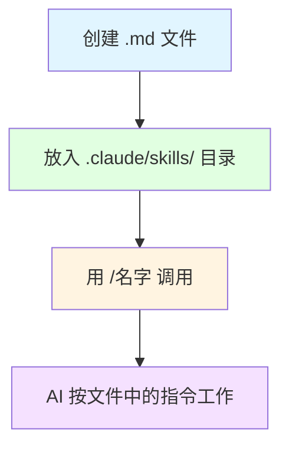
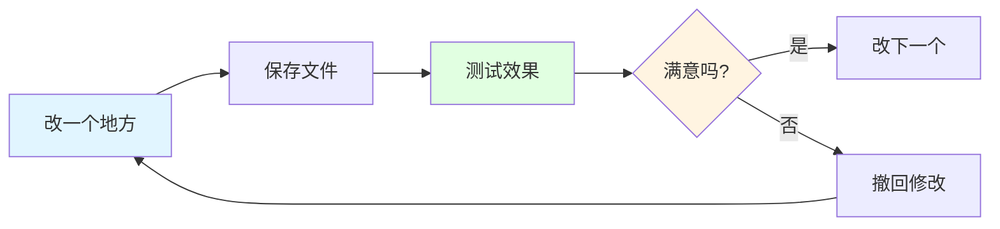
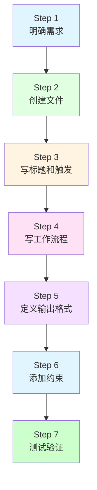
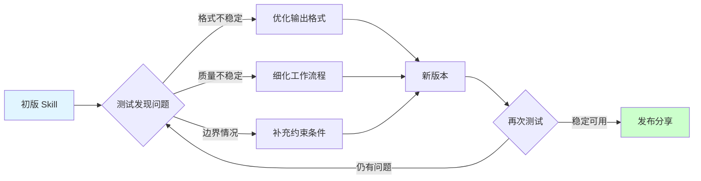

# 实战专题：Claude Code Skills — 打造你的 AI 专属工作流

> **课程时长**: 3 小时 | **难度**: 进阶 | **风格**: 实操为主

---

## 📋 本课概览

```
┌─────────────────────────────────────────────────────────────────┐
│  🎯 核心观点：Skill 让你把重复的 AI 指令变成一键命令            │
├─────────────────────────────────────────────────────────────────┤
│  📚 你将学到：                                                   │
│    • 理解 Skill 的本质（预写好的 AI 工作指令）                   │
│    • 体验和使用现成的 Skill                                      │
│    • 读懂 Skill 文件的结构                                       │
│    • 修改现有 Skill 来适配自己的需求                             │
│    • 从零编写一个完整的自定义 Skill                              │
│    • 测试、调试和分享你的 Skill                                  │
├─────────────────────────────────────────────────────────────────┤
│  🎁 你将带走：                                                   │
│    • 一张《Skill 结构速查卡》（打印贴工位）                      │
│    • 3 个填空式 Skill 模板（复制即用）                           │
│    • 一份《常见问题排查清单》                                    │
│    • 一个你亲手写的、可以立刻投入使用的自定义 Skill              │
│    • 10 个 Skill 创意清单（课后练习灵感）                        │
└─────────────────────────────────────────────────────────────────┘
```

**本课的承诺**：
- 不需要任何编程基础
- 你写的不是"代码"，而是"结构化的工作说明书"
- 每个步骤都有模板，照着填就行
- 学完当天就能用上

**学习路径**：


---

## 📖 课程内容

### Section 1：Skill 是什么（15 分钟）

#### 一个真实的烦恼

小王是一家互联网公司的运营，每周五都要写周报。她发现用 AI 写周报很方便，但每次都要输入一大段提示词：

> "你是一个周报助手。请把以下工作内容整理成周报格式，分为'本周完成'、'下周计划'、'需要协助'三个部分，每部分用要点列表，总字数不超过 300 字，语言简洁专业..."

每周都要找到这段话、复制、粘贴、再把本周内容贴进去。有时候忘了某个要求，输出格式就不对。

**如果有一种方法，让她只需要输入 `/weekly-report`，AI 就自动按她定义好的格式和要求来工作呢？**

这就是 Skill。

#### 核心类比：菜谱与厨师

把 Claude Code 想象成一位全能厨师：

- **没有菜谱时**：你每次都要口头描述"我要一道糖醋排骨，要用里脊肉，先炸后炒，糖醋比例 3:2..."——说漏一个细节，味道就不对
- **有了菜谱后**：你只需要说"做这道菜"，厨师按菜谱执行，每次味道都一样

**Skill 就是你写给 AI 的"菜谱"**。

#### 什么是 Claude Code？

一句话：**Claude Code 是运行在终端里的 AI 助手**，它能读写文件、执行命令、帮你完成各种任务。你通过打字和它对话，它帮你干活。

#### 什么是 Skill？

一句话：**Skill 是一个 `.md` 文件，里面写好了指令，让 Claude Code 按你定义的方式完成特定任务。**

它解决三个痛点：
1. 📋 **重复输入** — 不用每次都写一大段提示词
2. 🎯 **质量不稳定** — 指令固定，输出一致
3. 🧠 **记不住步骤** — 复杂工作流写进文件，永远不会忘

#### Skill vs 普通提示词

| 维度 | 普通提示词 | Skill |
|------|-----------|-------|
| 存储 | 每次手动输入或从笔记复制 | 保存为文件，永久可用 |
| 调用 | 粘贴一大段文字 | 输入 `/名字` 一个命令 |
| 稳定性 | 每次措辞不同，结果波动 | 指令固定，输出一致 |
| 分享 | 发消息给同事 | 放进项目目录，团队自动共享 |
| 复杂度 | 适合单步任务 | 可编排多步骤工作流 |

#### 小结

> 💡 **一句话记住**：Skill = 保存在文件里的 AI 工作指令，用 `/名字` 一键调用。

---

### Section 2：体验现成 Skill（20 分钟）

#### 准备工作

在开始之前，确认你的电脑上已经安装了 Claude Code：

**检查方法**：打开终端（Mac 用"终端"应用，Windows 用 PowerShell），输入：

```bash
claude --version
```

如果看到版本号，说明已安装。如果提示"命令未找到"，请按以下步骤安装：

```bash
npm install -g @anthropic-ai/claude-code
```

::: tip 遇到问题？
- **提示 npm 未找到**：需要先安装 Node.js，访问 https://nodejs.org 下载安装
- **提示权限不足**：Mac/Linux 用户在命令前加 `sudo`
- **安装后仍找不到命令**：关闭终端重新打开
:::

#### 动手体验

**第一步：启动 Claude Code**

在终端输入：

```bash
claude
```

你会看到 Claude Code 的交互界面，可以开始对话了。

**第二步：创建练习目录**

让我们创建一个专门的练习目录，并放入示例 Skill：

```bash
mkdir -p my-skill-practice/.claude/skills
cd my-skill-practice
```

**第三步：创建你的第一个示例 Skill**

用任何文本编辑器（记事本、VS Code、甚至 TextEdit 都行）创建文件 `.claude/skills/daily-summary.md`，内容如下：

```markdown
# 日报生成

把今天的工作笔记整理成简洁的日报格式。

Use when the user asks to "写日报", "daily summary", or "今日总结".

## 工作流程

1. 从用户提供的文本中提取今日完成的工作事项
2. 按重要程度排序
3. 用简洁的一句话概括每项工作
4. 如果有明日计划相关内容，单独列出

## 输出格式

### 📅 今日工作
- [要点 1]
- [要点 2]
- ...

### 📋 明日计划
- [如有则列出，无则写"待定"]

## 约束

- 每个要点不超过 20 字
- 总条目不超过 8 条
- 不添加原文中没有的内容
- 使用中文
```

**第四步：体验 Skill 的效果**

在 Claude Code 中输入 `/daily-summary`，然后粘贴一段工作笔记：

```
今天上午开了产品评审会，讨论了 v2.0 的功能优先级。
下午和设计师对了登录页面的改版方案，基本确定了方向。
处理了 3 个客户反馈的 bug，其中 2 个已修复提交。
和市场部确认了下周发布会的物料需求。
明天要准备周五的演示 demo。
```

观察输出：AI 会按照你定义的格式，自动整理成结构化的日报。

**第五步：对比体验**

现在试试不用 Skill，直接把同样的文字粘贴给 Claude Code，不加任何提示词。对比两次输出：
- 格式一样吗？
- 哪个更符合你的需求？
- 哪个更稳定可预测？

#### 你刚才做了什么？



就这么简单：**写一个文件 → 放对位置 → 用斜杠调用**。

接下来，我们打开这个文件，看看它的每一部分到底在做什么。

---

### Section 3：解剖一个 Skill（25 分钟）

#### 消除恐惧：这不是代码

你在 Section 2 创建的那个文件，看起来像代码吗？其实它就是一份**结构化的工作说明书**，用的是 Markdown 格式——和你在语雀、Notion、飞书文档里写笔记用的格式一模一样。

让我们把刚才的 `daily-summary.md` 文件拆开，看看每一部分在做什么。

#### Skill 文件的 6 个组成部分

```
┌─────────────────────────────────────────────┐
│  # 标题                                      │  ← ① 名字（也是 /命令名）
├─────────────────────────────────────────────┤
│  一句话描述                                  │  ← ② 这个 Skill 做什么
├─────────────────────────────────────────────┤
│  Use when...                                 │  ← ③ 什么时候用
├─────────────────────────────────────────────┤
│  ## 工作流程                                 │  ← ④ 分步骤的执行指令
├─────────────────────────────────────────────┤
│  ## 输出格式                                 │  ← ⑤ 结果长什么样
├─────────────────────────────────────────────┤
│  ## 约束                                     │  ← ⑥ 不该做什么
└─────────────────────────────────────────────┘
```

#### 逐部分解读

让我们用"日报生成"这个 Skill 来逐一对照：

**① 标题（`# 日报生成`）**

- 作用：给 Skill 起名字
- 规则：文件名去掉 `.md` 就是你的斜杠命令名
  - 文件名 `daily-summary.md` → 命令 `/daily-summary`
- 注意：文件名用英文和短横线，标题可以用中文

**② 描述段落**

```markdown
把今天的工作笔记整理成简洁的日报格式。
```

- 作用：一句话告诉 AI（和你自己）这个 Skill 的用途
- 写法：简洁明了，一句话说清楚"输入什么 → 输出什么"

**③ 触发说明（`Use when...`）**

```markdown
Use when the user asks to "写日报", "daily summary", or "今日总结".
```

- 作用：告诉 Claude 什么情况下应该使用这个 Skill
- 写法：列出用户可能说的关键词或短语
- 提示：多写几个同义词，覆盖不同的表达方式

**④ 工作流程（`## 工作流程`）**

```markdown
1. 从用户提供的文本中提取今日完成的工作事项
2. 按重要程度排序
3. 用简洁的一句话概括每项工作
4. 如果有明日计划相关内容，单独列出
```

- 作用：告诉 AI 具体该怎么做，按什么顺序做
- 写法：用编号列表，每步一个动作，越具体越好
- 类比：就像给新员工写的操作手册

**⑤ 输出格式（`## 输出格式`）**

```markdown
### 📅 今日工作
- [要点 1]
- [要点 2]

### 📋 明日计划
- [如有则列出，无则写"待定"]
```

- 作用：定义输出的结构和样式
- 写法：直接写出你期望看到的格式模板
- 提示：用 `[方括号]` 标注需要 AI 填入的内容

**⑥ 约束（`## 约束`）**

```markdown
- 每个要点不超过 20 字
- 总条目不超过 8 条
- 不添加原文中没有的内容
- 使用中文
```

- 作用：画红线，告诉 AI 什么不能做
- 写法：用"不"字开头的规则最清晰
- 提示：字数限制、语言要求、禁止行为都写在这里

#### 文件放在哪里？

Skill 文件有两个可以放的位置：

| 位置 | 路径 | 生效范围 |
|------|------|----------|
| 全局 | `~/.claude/skills/` | 所有项目都能用 |
| 项目级 | `项目目录/.claude/skills/` | 仅当前项目生效 |

- **个人常用的 Skill**（如日报、周报）→ 放全局
- **团队共享的 Skill**（如项目特定的文档格式）→ 放项目级

#### 动手练习

打开你在 Section 2 创建的 `daily-summary.md` 文件，用笔（或不同颜色的高亮）标注：

1. 哪一行是标题？
2. 哪一行是描述？
3. 触发说明在哪里？
4. 工作流程有几步？
5. 输出格式定义了几个区块？
6. 约束有几条？

::: tip 记住这个口诀
**名-描-触-流-格-约**：名字、描述、触发、流程、格式、约束。六个部分，缺一不可（触发说明可选但推荐）。
:::

---

### Section 4：改造现成 Skill（25 分钟）

现在你已经知道 Skill 文件的每个部分是什么了。接下来，我们通过**小修改**来建立"我能改"的信心。

规则很简单：**每次只改一个地方，保存，测试，看效果。**

#### 第一步：改输出格式（5 分钟）

打开 `.claude/skills/daily-summary.md`，找到"输出格式"部分。

**原来的**：
```markdown
## 输出格式

### 📅 今日工作
- [要点 1]
- [要点 2]

### 📋 明日计划
- [如有则列出，无则写"待定"]
```

**改成**：
```markdown
## 输出格式

| 序号 | 今日完成事项 | 重要程度 |
|------|-------------|---------|
| 1    | [事项]      | ⭐/⭐⭐/⭐⭐⭐ |

### 📋 明日计划
- [如有则列出，无则写"待定"]
```

保存文件，然后用 `/daily-summary` 测试。你会发现输出从列表变成了表格，还多了重要程度标注。

#### 第二步：改工作流程（10 分钟）

现在我们给 Skill 增加一个新能力：**自动统计工作量**。

找到"工作流程"部分，在最后加一步：

```markdown
## 工作流程

1. 从用户提供的文本中提取今日完成的工作事项
2. 按重要程度排序
3. 用简洁的一句话概括每项工作
4. 如果有明日计划相关内容，单独列出
5. 在末尾统计：共完成 X 项工作，其中重要事项 Y 项
```

同时在"输出格式"末尾加上：

```markdown
### 📊 今日统计
- 完成事项：X 项
- 重要事项：Y 项
```

保存，测试。现在你的日报会自动带上工作量统计了。

#### 第三步：改触发说明（10 分钟）

假设你希望这个 Skill 不仅能写日报，还能在你说"帮我总结一下"的时候触发。

找到 `Use when...` 这一行：

**原来的**：
```markdown
Use when the user asks to "写日报", "daily summary", or "今日总结".
```

**改成**：
```markdown
Use when the user asks to "写日报", "daily summary", "今日总结", "帮我总结一下", or "summarize my work".
```

保存，测试。试着输入"帮我总结一下"，看看 Skill 是否被触发。

#### 改造心法



::: warning 改坏了怎么办？
不要慌。Skill 文件就是普通文本文件：
- **撤回修改**：Ctrl+Z（Mac 用 Cmd+Z）
- **从头来过**：删掉文件，从 Section 2 的模板重新复制一份
- **不会影响其他东西**：Skill 文件只影响 AI 的行为，不会改动你的其他文件
:::

::: tip 常见问题
- **改完没效果？** → 确认文件已保存。有些编辑器需要手动 Ctrl+S
- **输出格式乱了？** → 检查 Markdown 格式：表格的 `|` 对齐了吗？列表前有空行吗？
- **不确定改哪里？** → 回看 Section 3 的结构图，定位你要改的是哪个部分
:::

---

### Section 5：从零创建 Skill（50 分钟）

到这里，你已经会用 Skill、看懂 Skill、改 Skill 了。现在，让我们从一个空白文件开始，写出属于你自己的 Skill。

#### 选择你的案例

下面有 3 个场景，选一个最贴近你日常工作的：

| 案例 | 场景 | 适合谁 |
|------|------|--------|
| A：周报生成 | 把工作笔记整理成周报 | 需要定期写周报的人 |
| B：会议纪要 | 把会议记录整理成结构化纪要 | 经常开会的人 |
| C：内容改写 | 把文章改写为不同平台风格 | 做内容运营的人 |

选好了？下面我们按 7 步走完整个过程。**无论你选哪个案例，步骤都一样。**

#### 7 步创建法



---

#### Step 1：明确需求（5 分钟）

在动手之前，先回答这 3 个问题：

| 问题 | 案例 A 的答案 | 案例 B 的答案 | 案例 C 的答案 |
|------|--------------|--------------|--------------|
| 解决什么问题？ | 每周手动整理周报太慢 | 会议记录太乱看不懂 | 一篇文章要发多个平台 |
| 输入是什么？ | 本周工作笔记（纯文本） | 会议转写文本 | 原始文章 + 目标平台 |
| 输出是什么？ | 三段式周报 | 结构化纪要 + 待办表 | 适配平台风格的改写版 |

#### Step 2：创建文件（5 分钟）

在终端中创建文件：

::: code-group

```bash [案例 A：周报]
touch .claude/skills/weekly-report.md
```

```bash [案例 B：会议纪要]
touch .claude/skills/meeting-notes.md
```

```bash [案例 C：内容改写]
touch .claude/skills/content-rewrite.md
```

:::

然后用文本编辑器打开这个文件。

#### Step 3：写标题和触发说明（5 分钟）

在文件开头写入：

::: code-group

```markdown [案例 A：周报]
# 周报生成

把本周工作笔记整理成结构化周报。

Use when the user asks to "生成周报", "写周报", "weekly report", or "本周总结".
```

```markdown [案例 B：会议纪要]
# 会议纪要整理

把会议录音转写的原始文字整理成结构化的会议纪要。

Use when the user asks to "整理会议纪要", "meeting notes", "会议记录", or pastes a block of meeting transcript text.
```

```markdown [案例 C：内容改写]
# 内容改写

把一篇文章改写为指定平台的风格和格式。

Use when the user asks to "改写", "rewrite", "转平台", or provides text with a target platform name like "小红书", "公众号", or "LinkedIn".
```

:::

#### Step 4：编写工作流程（10 分钟）

接着写 `## 工作流程`，用编号列表描述 AI 应该做什么：

::: code-group

```markdown [案例 A：周报]
## 工作流程

1. 从用户粘贴的文本中提取本周完成的工作事项
2. 识别下周计划相关的内容
3. 提取需要协助或存在阻塞的事项
4. 按"本周完成 → 下周计划 → 需要协助"的顺序组织
5. 每个事项用一句话概括，突出结果而非过程
```

```markdown [案例 B：会议纪要]
## 工作流程

1. 识别参会人员（从对话中提取发言者姓名）
2. 提取核心议题（按讨论顺序列出）
3. 归纳每个议题的结论或决议
4. 提取所有待办事项，标注负责人和截止日期
5. 过滤口水话、重复内容、无意义的过渡语
```

```markdown [案例 C：内容改写]
## 工作流程

1. 分析原始文章的核心观点和关键信息
2. 根据目标平台确定风格和字数要求：
   - 公众号：深度长文，1500-3000 字，段落分明，适当使用小标题
   - 小红书：轻松口语，300-800 字，多用 emoji，开头要有 hook
   - LinkedIn：专业简洁，500-1000 字，英文为主，突出洞察和数据
3. 按目标平台风格重写内容
4. 检查字数是否在目标范围内
```

:::

#### Step 5：定义输出格式（10 分钟）

写 `## 输出格式`，用模板展示你期望的输出结构：

::: code-group

```markdown [案例 A：周报]
## 输出格式

### ✅ 本周完成
- [要点列表，每项一句话，突出成果]

### 📋 下周计划
- [要点列表]

### 🚨 需要协助
- [如无则写"暂无"]
```

```markdown [案例 B：会议纪要]
## 输出格式

### 会议信息
- 日期：[从文本推断或标注"未知"]
- 参会人：[逗号分隔的姓名列表]

### 议题与决议

**1. [议题名称]**
- 讨论要点：[简要概括]
- 决议：[最终结论]

### 待办事项

| 事项 | 负责人 | 截止日期 |
|------|--------|----------|
| [具体事项] | [姓名] | [日期或"待确认"] |
```

```markdown [案例 C：内容改写]
## 输出格式

### 平台：[目标平台名]
### 字数：[实际字数]

---

[改写后的正文]

---

### 改写说明
- 保留的核心观点：[列出]
- 主要风格调整：[说明做了什么改动]
```

:::

#### Step 6：添加约束（5 分钟）

写 `## 约束`，画出红线：

::: code-group

```markdown [案例 A：周报]
## 约束

- 总字数不超过 300 字
- 不添加原文中没有的工作内容
- 不使用夸张或邀功的措辞
- 每个要点不超过 25 字
- 使用中文输出
```

```markdown [案例 B：会议纪要]
## 约束

- 总输出不超过原文的 30%
- 不添加原文中没有的信息或决议
- 如果无法确定负责人或截止日期，标注"待确认"
- 不对讨论内容做价值判断
- 使用中文输出
```

```markdown [案例 C：内容改写]
## 约束

- 不改变原文的核心观点和事实
- 不添加原文中没有的数据或引用
- 如果用户未指定平台，先询问目标平台再改写
- 严格遵守目标平台的字数范围
- 默认使用中文输出（LinkedIn 除外）
```

:::

#### Step 7：测试验证（10 分钟）

保存文件，然后测试：

**测试方法**：

1. 在 Claude Code 中用 `/你的skill名` 调用
2. 粘贴一段测试输入（用你真实的工作内容效果最好）
3. 检查输出：
   - ✅ 格式对吗？（和你定义的输出格式一致）
   - ✅ 内容对吗？（没有编造信息）
   - ✅ 约束遵守了吗？（字数、语言等）
4. **重复测试 3 次**，确认输出质量稳定

**如果输出不理想**：

| 问题 | 可能原因 | 解决方法 |
|------|---------|---------|
| 格式不对 | 输出格式部分不够具体 | 把模板写得更详细，加上示例 |
| 内容有编造 | 约束部分没写清楚 | 加一条"不添加原文没有的信息" |
| 太长/太短 | 没有字数限制 | 在约束中加字数上限 |
| 忽略了某个步骤 | 工作流程描述太模糊 | 把那一步拆成更具体的子步骤 |

::: tip 成功标准
连续 3 次调用，输出都符合你的预期格式和质量要求 = 你的 Skill 写成功了！🎉
:::

---

### Section 6：测试、迭代与分享（20 分钟）

你的 Skill 写完了，但这只是开始。好的 Skill 是迭代出来的。

#### 迭代优化的 3 个方向



**方向 1：优化输出格式**

如果输出格式不稳定（有时有表格，有时没有），试试这些方法：

- 在输出格式部分加上 **完整的示例**（不只是模板，而是填好内容的例子）
- 用 Markdown 代码块包裹模板（让 AI 更容易识别格式）
- 在约束中加一条"严格遵守输出格式部分的结构"

**方向 2：细化工作流程**

如果输出质量不稳定（有时很好，有时很差），检查工作流程：

- 是否有步骤太模糊？（比如"整理内容" → 改成"提取关键信息，去除重复和无关内容"）
- 是否缺少关键步骤？（比如忘了写"检查字数"）
- 步骤顺序是否合理？（先做什么，后做什么）

**方向 3：补充约束条件**

如果遇到边界情况（比如输入太短、输入格式不对），加约束：

```markdown
## 约束

- 如果输入少于 50 字，提示"内容太少，无法生成周报"
- 如果输入中没有日期信息，在输出中标注"日期：未知"
- 如果用户未指定目标平台，先询问再改写
```

#### 版本管理

Skill 文件就是普通的 Markdown，可以用 Git 管理版本：

```bash
# 初始化 Git（如果还没有）
cd .claude/skills
git init

# 提交第一个版本
git add weekly-report.md
git commit -m "v1.0: 初版周报生成 Skill"

# 修改后提交新版本
git add weekly-report.md
git commit -m "v1.1: 优化输出格式，添加字数约束"
```

这样你可以随时回退到之前的版本。

#### 分享你的 Skill

如果你的 Skill 很好用，可以分享给同事或社区：

**方法 1：直接分享文件**

把 `.claude/skills/your-skill.md` 文件发给对方，对方放到自己的 `.claude/skills/` 目录就能用。

**方法 2：发布到 GitHub**

```bash
# 创建一个仓库
mkdir my-claude-skills
cd my-claude-skills
git init

# 复制你的 Skill 文件
cp ~/.claude/skills/weekly-report.md ./

# 写一个 README
cat > README.md << 'EOF'
# 我的 Claude Code Skills

## 周报生成

把工作笔记整理成结构化周报。

### 安装

```bash
curl -o ~/.claude/skills/weekly-report.md \
  https://raw.githubusercontent.com/你的用户名/my-claude-skills/main/weekly-report.md
```

### 使用

在 Claude Code 中输入 `/weekly-report`，然后粘贴你的工作笔记。
EOF

# 提交并推送
git add .
git commit -m "Initial commit"
git remote add origin https://github.com/你的用户名/my-claude-skills.git
git push -u origin main
```

**方法 3：贡献到官方仓库**

Anthropic 维护了一个 [官方 Skills 仓库](https://github.com/anthropics/claude-code-skills)（假设存在），你可以提交 Pull Request 贡献你的 Skill。

---

### 附录

#### A. Skill 文件格式速查

```markdown
# [Skill 名称]

[一句话描述这个 Skill 做什么]

Use when the user asks to "[触发短语1]", "[触发短语2]", or [触发条件描述].

## 工作流程

1. [第一步做什么]
2. [第二步做什么]
...

## 输出格式

[用 Markdown 展示期望的输出结构]

## 约束

- [约束条件 1]
- [约束条件 2]
...
```

#### B. 常见问题

**Q1：Skill 不生效怎么办？**

检查清单：
- ✅ 文件放在 `.claude/skills/` 目录下了吗？
- ✅ 文件扩展名是 `.md` 吗？
- ✅ 文件名和调用时的名字一致吗？（`/weekly-report` 对应 `weekly-report.md`）
- ✅ 重启 Claude Code 了吗？

**Q2：如何让 Skill 支持多语言？**

在约束中加一条：

```markdown
## 约束

- 根据用户输入的语言自动选择输出语言（中文输入 → 中文输出，英文输入 → 英文输出）
```

**Q3：Skill 可以调用其他 Skill 吗？**

不能直接调用，但可以在工作流程中提示 AI：

```markdown
## 工作流程

1. 先用 writing-plans skill 的思路分析任务
2. 然后按本 Skill 的格式输出
```

**Q4：Skill 可以访问文件吗？**

可以。在工作流程中写明：

```markdown
## 工作流程

1. 读取用户指定的文件（使用 Read 工具）
2. 提取文件中的关键信息
...
```

**Q5：如何让 Skill 输出更稳定？**

三个技巧：
1. **输出格式部分用完整示例**（不只是模板）
2. **约束部分加"严格遵守输出格式"**
3. **工作流程拆得足够细**（每步只做一件事）

#### C. 进阶资源

- **官方文档**：[Claude Code Skills 文档](https://docs.anthropic.com/claude/docs/claude-code-skills)（假设链接）
- **社区 Skills**：[GitHub - anthropics/claude-code-skills](https://github.com/anthropics/claude-code-skills)（假设链接）
- **提示词工程**：[Anthropic Prompt Engineering Guide](https://docs.anthropic.com/claude/docs/prompt-engineering)

#### D. 下一步

学完这个专题，你可以：

1. **回到主线课程**：如果你是从 [Lesson 5](./lesson-5.md) 跳过来的，现在可以回去继续学习
2. **探索更多 Skills**：浏览社区分享的 Skills，看看别人怎么写的
3. **写更复杂的 Skill**：尝试写一个需要多步推理、文件操作、或调用外部工具的 Skill

---

::: tip 恭喜你！🎉
你已经掌握了 Claude Code Skills 的完整工作流：**用 → 看 → 改 → 写**。

现在，你可以为任何重复性的工作创建自己的 AI 助手了。
:::

---

**返回**：[课程目录](../index.md) | **相关课程**：[Lesson 5: 进阶技巧](./lesson-5.md)
